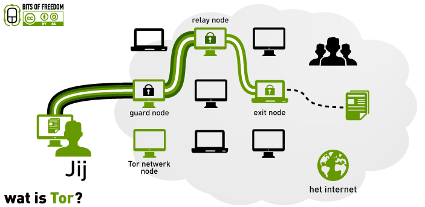

Hoe Publeaks is opgezet
=============

1. [Het platform](#het-platform)
2. [Tor netwerk](#tor-netwerk)
3. [PGP versleuteling van bestanden](#pgp-versleuteling-van-bestanden)
4. [Een laptop met Tails Linux](#een-laptop-met-tails-linux)
5. [Wachtwoorden](#wachtwoorden)

[Terug naar de inhoudsopgave](README.md#inhoudsopgave)

***

Het platform
-------------

Het primaire doel van het Publeaks platform is te zorgen dat tipgevers anoniem kunnen blijven als zij dat willen. Daartoe heeft Publeaks een systeem opgezet dat op verschillende manieren zorgt dat de identiteit van een tipgever niet bekend wordt. Zo maakt Publeaks gebruik van het Tor netwerk en worden bestanden alleen versleuteld met PGP opgeslagen.

Hierbij moet worden opgemerkt dat geen enkele techniek feilloos is, dus ook die van Publeaks niet. Wel heeft Publeaks, mede door gebruik te maken van de nieuwste technieken, het voor de tipgevers zo veilig mogelijk gemaakt.

Tor netwerk
-------------

Bezoekers van de Publeaks website wordt daarvoor aangeraden dit alleen te doen via het Tor netwerk en dit geld nog extra voor eventuele tipgevers. Het Tor netwerk is namelijk ontworpen om je anoniem op internet te kunnen begeven en zo ook anoniem Publeaks te bezoeken.

**Hoe werkt Tor?**

Het anonimiseren werkt doordat Tor op zijn weg naar het internet eerst driemaal een willekeurige en versleutelde verbinding maakt met een computer in het Tor netwerk. De website die wordt bezocht kan daardoor bijna onmogelijk herleiden wie feitelijk de website bezoekt.

Bij het Publeaks platform is het niet alleen de gebruiker die van Tor gebruik maakt, maar ook de server zelf. Niet alleen de gebruiker is dan anoniem, maar ook de server. Hierdoor is het op de server van Publeaks niet alleen onmogelijk om te achterhalen wie bestanden naar de Publeaks server heeft geüpload, maar ook dat niemand kan achterhalen waar de server fysiek staat. Daardoor is toegang krijgen tot de server en de data daarop een stuk moeilijker.

Mocht een bezoeker zelf niet direct gebruik van het Tor netwerk willen of kunnen maken, dan werkt de normale Publeaks website als proxy naar het Tor netwerk. De verbinding met de website is dan beveiligd met SSL en vanaf daar wordt dan via het Tor netwerk een verbinding opgezet met de Publeaks server waar de data wordt opgeslagen.

PGP versleuteling van bestanden
-------------

Bestanden die worden geüpload naar de server worden daar versleuteld met PGP opgeslagen. Daarvoor worden alleen die PGP sleutels gebruikt die horen bij de media waarvan de tipgever heeft aangegeven dat deze er zijn informatie aan wil geven. Dus alleen die media en niemand anders kan daarna nog die bestanden ontsleutelen.

**Hoe werkt PGP?**

PGP is een zogenoemde asymmetrische encryptie methode die werkt met sleutelparen. Elk sleutelpaar bestaat uit twee sleuteldelen, een publiek deel en een privé deel. De publieke sleutel wordt gebruikt voor het versleutelen van data en het privé deel voor het ontsleutelen van data.


Doordat je de publieke sleutel alléén gebruikt om data te versleutelen, kun je deze sleutel zonder problemen aan iedereen geven. Jij bent vervolgens de enige die de daarmee versleutelde data met jouw privé sleutel kan ontsleutelen. Deze versleutelde data kan dus veilig worden opgeslagen of worden verstuurd, zonder het gevaar dat iemand anders dit kan lezen of gebruiken.

Het is dus zeer van belang dat de privé sleutel veilig wordt bewaard en van een zeer goed wachtwoord wordt voorzien.

**Wat is het verschil tussen PGP en GPG?**

PGP en GPG (ook wel GnuPG) hebben beide dezelfde oorsprong en dezelfde functionaliteit. Het belangrijkste verschil is dat PGP betaalde software is en GPG vrij beschikbare open-source software is. Linux maakt standaard gebruik van de GPG.

Een laptop met Tails Linux
-------------

De journalist gebruikt voor het ophalen van de tips een speciaal daarvoor geconfigureerde laptop met Tails Linux. Deze laptop biedt de mogelijkheid om in een veilige omgeving bestanden te anonimiseren voordat ze de wereld in worden gebracht.

Tails is een Linux versie die speciaal is ontwikkeld om je veilig en anoniem op het internet te begeven. De standaard browser is daarom van Tor voorzien. Tails is ook minder kwetsbaar voor malafide software, doordat de installatie niet zomaar is aan te passen en het telkens 'schoon' wordt opgestart.

Voor de journalisten is de anonimiteit misschien wat minder van belang, zij maken er tenslotte geen geheim van dat ze gebruik maken van Publeaks, maar de extra veiligheid die Tails biedt is wel erg belangrijk. De laptop laat geen sporen achter van wat een journalist op het systeem heeft gedaan en het systeem bied de mogelijkheid om data versleuteld op te slaan. Hierdoor kunnen ontvangen bestanden veilig worden gedownload, van eventuele (meta)data worden ontdaan en worden bewaard en bewerkt, zonder gevaar dat er iets van uitlekt. Voor het verwijderen van metadata is er speciale software op de laptop aanwezig die de journalist hierbij kan helpen.

Wachtwoorden
-------------

Voor het Publeaks platform worden meerdere wachtwoorden gebruikt, namelijk voor de account op de Publeaks website, voor de versleutelde opslag op de laptop en voor de PGP sleutel. Het is natuurlijk erg belangrijk om hier goede en sterke wachtwoorden te gebruiken.

**Wat is een veilig wachtwoord?**

Het belangrijkste bij een goed wachtwoord is de lengte, het is daarom ook beter om van een wachtzin te spreken dan van een wachtwoord. Gebruik in elk geval wachtwoorden van minimaal 12 karakters, maar meer is beter. Daarnaast is het natuurlijk goed om een combinatie te hebben van kleine letters, hoofdletters, cijfers en overige tekens, maar lengte wint het van complexiteit. Een wachtwoord “Zwaaien Ziet Zwaan” is daarom een beter wachtwoord dan “Q$4e”.

**Wachtwoord vergeten?**

Er zitten in PGP en de versleutelde opslag op de Tails usb-stick géén achterdeurtjes of workarounds. Als een wachtwoord kwijt is, dan is daar helemaal niets meer aan te doen. Alle data die dan nog met de desbetreffende sleutel is versleuteld, moet als verloren worden beschouwd.

Wel is het mogelijk een nieuwe publieke PGP sleutel aan te maken en naar de Publeaks website te uploaden. Dit kan op dezelfde manier gebeuren als de eerste keer dat de PGP sleutels werd aangemaakt en zoals in het hoofdstuk “Het aanmaken van een PGP sleutelpaar” in de handleiding wordt beschreven. Bij nieuwe tips wordt dan gebruik gemaakt van deze nieuwe sleutel waarvan het wachtwoord dan natuurlijk wel bekend is. Eventueel kan een tipgever worden gevraagd de documenten nogmaals te uploaden, zodat deze alsnog beschikbaar komen.
